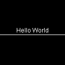
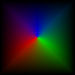
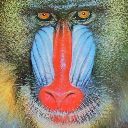
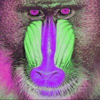
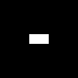
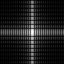
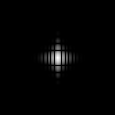

# ImagingKit
#### [Master Branch](https://github.com/hageldave/ImagingKit/tree/master)
[](https://travis-ci.com/github/hageldave/ImagingKit/branches)
[](https://coveralls.io/github/hageldave/ImagingKit?branch=master)
[](http://search.maven.org/#artifactdetails|com.github.hageldave.imagingkit|imagingkit-core|2.1|jar)
---
#### [Development Branch](https://github.com/hageldave/ImagingKit/tree/devel2.0)
[](https://travis-ci.com/github/hageldave/ImagingKit/branches)
[](https://coveralls.io/github/hageldave/ImagingKit?branch=devel2.0)
---

A Java library for imaging tasks that integrates well with the commonly used java.awt.image environment (especially well with TYPE_INT BufferedImages). Its goal is to make image processing more convenient and to ease performance optimization. The library is intended for images using integer typed values like 24bit RGB or 32bit ARGB. 

So far the *ImagingKit-Core* and *ImagingKit-Fourier* artifacts of the library are available through the maven central repository:
```xml
<dependency>
  <groupId>com.github.hageldave.imagingkit</groupId>
  <artifactId>imagingkit-core</artifactId>
  <version>2.1</version>
</dependency>

<dependency>
  <groupId>com.github.hageldave.imagingkit</groupId>
  <artifactId>imagingkit-fourier</artifactId>
  <version>2.1</version>
</dependency>
```

As this library aims at convenience and ease of use, look at this code snippet for grayscale conversion as a teaser:
```java
Img img = ImageLoader.loadImgFromURL("file:///home/pictures/rainbow.jpg");
for(Pixel px: img){
    int grey = (px.r() + px.g() + px.b()) / 3;
    px.setRGB(grey, grey, grey);
}
```
And now for the parallel processing part:
```java
img.stream().parallel().forEach( px -> {
    int grey = px.getLuminance();
    px.setRGB(grey, grey, grey);
});
```

---
### Code Examples
Convert an image to grayscale:
```java
BufferedImage buffimg = ImageLoader.loadImage("myimage_colored.png", BufferedImage.TYPE_INT_ARGB);
Img img = Img.createRemoteImg(buffimg);
img.forEach(true, (pixel) -> {
    int gray = (pixel.r() + pixel.g() + pixel.b())/3;
    pixel.setARGB(pixel.a(), gray, gray, gray);
});
ImageSaver.saveImage(buffimg,"myimage_grayscale.png");
```


Draw into image (using java.awt.Graphics2D):
```java
Img img = new Img(128, 128);
img.fill(0xff000000);
img.paint(g2d -> {
	g2d.setColor(Color.white);
	String helloWorld = "Hello World";
	int textWidth = g2d.getFontMetrics().stringWidth(helloWorld);
	g2d.drawString(helloWorld, img.getWidth()/2-textWidth/2, img.getHeight()/2);
	g2d.drawLine(0, img.getHeight()/2+4, img.getWidth(), img.getHeight()/2+4);
});
ImageFrame.display(img);
ImageSaver.saveImage(img.getRemoteBufferedImage(), "hello_world.png");
```


Fancy polar color thing:
```java
Img img = new Img(128, 128);
img.forEach(px -> {
	double x = px.getXnormalized()*2-1;
	double y = px.getYnormalized()*2-1;
	double len = Math.max(Math.abs(x),Math.abs(y));
	double angle = (Math.atan2(x,y)+Math.PI)*(180/Math.PI);
	
	double r = Math.max(0,1-Math.abs((angle-120)/120.0));
	double g = Math.max(0, 1-Math.abs((angle-240)/120.0));
	double b = Math.max(0, angle <= 120 ? 
			1-Math.abs((angle)/120.0):1-Math.abs((angle-360)/120.0));
	
	px.setRGB_fromDouble(r*(1-len), g*(1-len), b*(1-len));
});
ImageFrame.display(img);
```


Shifting hue (using color space transformation):
```java
Img img = ImageLoader.loadImgFromURL("http://sipi.usc.edu/database/preview/misc/4.2.03.png");

img.forEach(ColorSpaceTransformation.RGB_2_HSV);
double hueShift = (360-90)/360.0;
img.forEach(pixel -> {
	// R channel corresponds to hue (modulo 1.0 for cyclic behaviour)
	pixel.setR_fromDouble((pixel.r_asDouble()+hueShift) % 1.0);
});
img.forEach(ColorSpaceTransformation.HSV_2_RGB);

ImageFrame.display(img);
```



Fourier Filtering
```java
ColorImg img = new ColorImg(128,128,false);
img.paint(g2d->g2d.fillRect(64-16, 64-8, 32, 16));
ImageFrame.display(img.getRemoteBufferedImage()).setTitle("original");
ComplexImg fourier = Fourier.transform(img, ColorImg.channel_r);
fourier.shiftCornerToCenter();
ImageFrame.display(fourier.getPowerSpectrumImg().toImg()).setTitle("fft");
fourier.forEach(px->{
	int xfreq = px.getXFrequency();
	int yfreq = px.getYFrequency();
	double freqRadius = Math.sqrt(xfreq*xfreq+yfreq*yfreq);
	double gaussian = Math.exp(-freqRadius/(0.05*128));
	px.mult(gaussian, 0);
});
ImageFrame.display(fourier.getPowerSpectrumImg().toImg()).setTitle("filtered fft");
ColorImg restored = Fourier.inverseTransform(null, fourier, ColorImg.channel_r);
ColorImg redChannel = restored.getChannelImage(ColorImg.channel_r);
ImageFrame.display(redChannel.toImg()).setTitle("filterd original");
```





